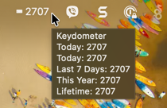
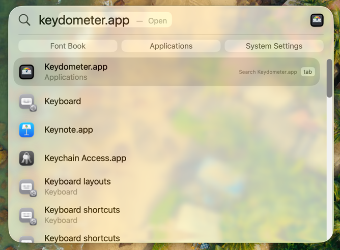
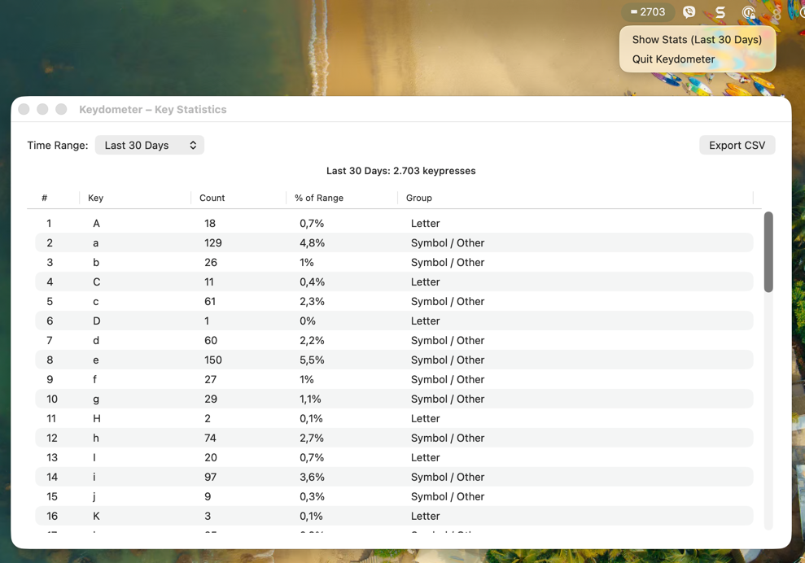
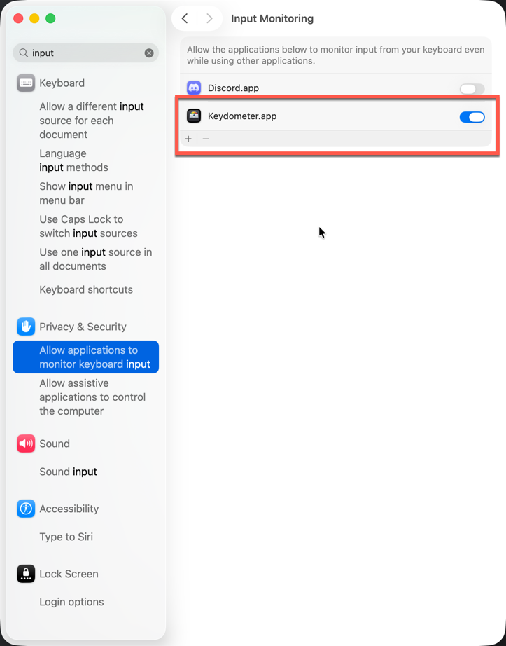
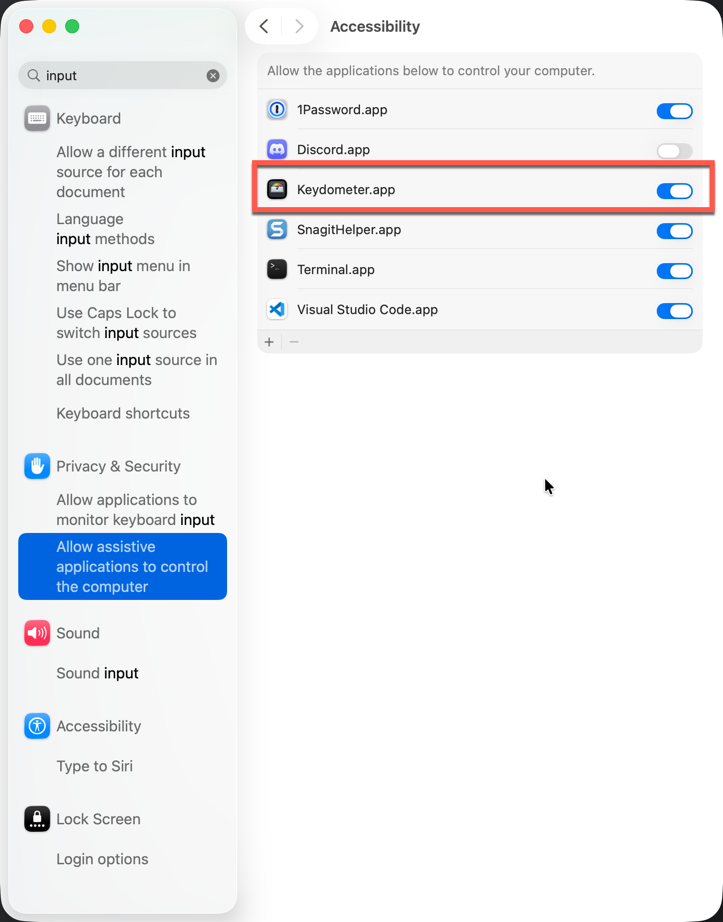
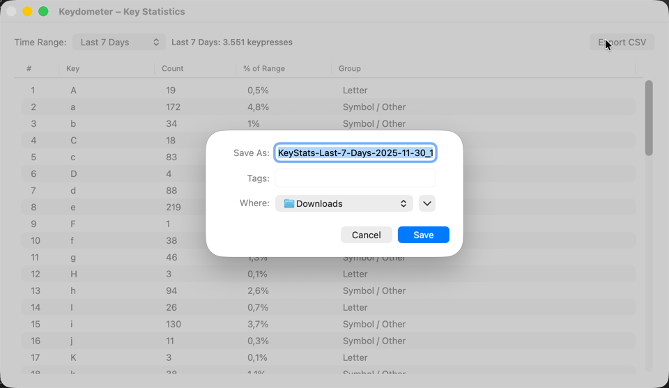
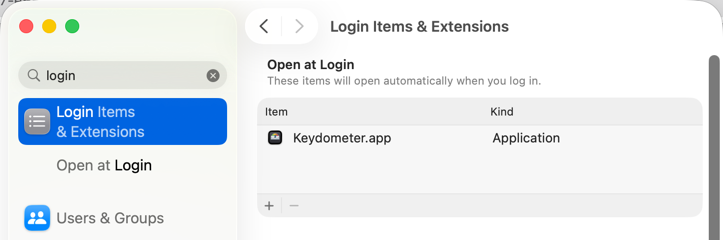
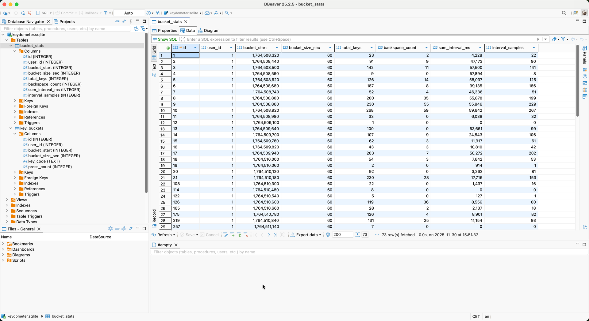
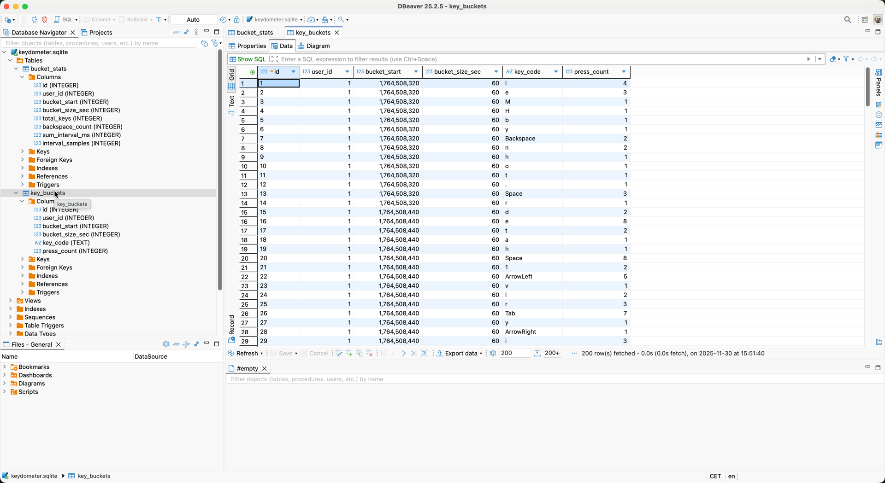

# Keydometer

Keydometer is a macOS menu-bar utility that monitors keyboard usage in real time, aggregates key counts per minute, and surfaces rich metrics like daily totals, streaks, most-used keys, and focus stats—without exposing the actual words you type.

Keydometer is written in Swift and uses SQLite for persistence.

### Built to respect privacy

- The accessibility event tap only records key codes so we can count presses; no clipboard data, text buffers, or window contents are captured.
- Events are bucketed into 60-second aggregates before being written to `~/Library/Application Support/Keydometer/keydometer.sqlite`, so there is never a row-by-row log of everything typed.
- Only totals (keys per minute, key-name counts, intervals between presses, and backspace counts) are stored, which lets the stats window work while preventing reconstruction of sentences or passwords.
- All data stays local; the app has zero networking code and nothing is uploaded or synced anywhere.

# Compile vs. Build

There are two ways to use Keydometer:

1. Build the command-line binary into `build/Keydometer` and launch it from Terminal. This is best while developing or debugging.
2. Build a `.app` bundle via the helper script so the app runs in the background and shows only the menu-bar item.

## See Keydometer in action

Keydometer lives in the menu bar and keeps everything you need a click away:



From the menu, open the search panel to inspect historical activity or jump to a specific window:



Use the stats view to review keystrokes, clicks, and key combos over time:



When first launching, macOS prompts for the required accessibility and input permissions:




Export CSV data or configure auto-start directly from the menu:




Peek under the hood at the SQLite schema that powers the metrics:




## Compile the CLI binary

```
mkdir -p build
swiftc src/*.swift -o build/Keydometer \
  -framework Cocoa \
  -framework ApplicationServices

./build/Keydometer
```

Running the binary directly launches Keydometer but keeps an attached Terminal window open.

## Build the background `.app`

Use the helper script to compile and wrap the binary inside a macOS app bundle:

```
./build_app.sh
open build/Keydometer.app
```

The script first compiles the binary into `build/Keydometer`, then copies it plus `Info.plist` (which sets `LSUIElement=1` so the app has no Dock icon) into `build/Keydometer.app/Contents`. Double-clicking `Keydometer.app` launches the same binary without any Terminal windows—perfect for daily use.

Be sure to set:

1) System Settings > Privacy & Security > Allow applications to monitor keyboard input > Keydometer.app

2) Allow assistive applicaitons to control the computer > Keydometer.app

# Add the app to auto-run on system login 

System Settings → General → Login Items

Then under “Open at Login”, click + and choose your .app.

# License

Keydometer is released under the [MIT License](LICENSE). Use it freely, modify it for your needs, and do so at your own discretion—the software is provided “as is” without warranty.
